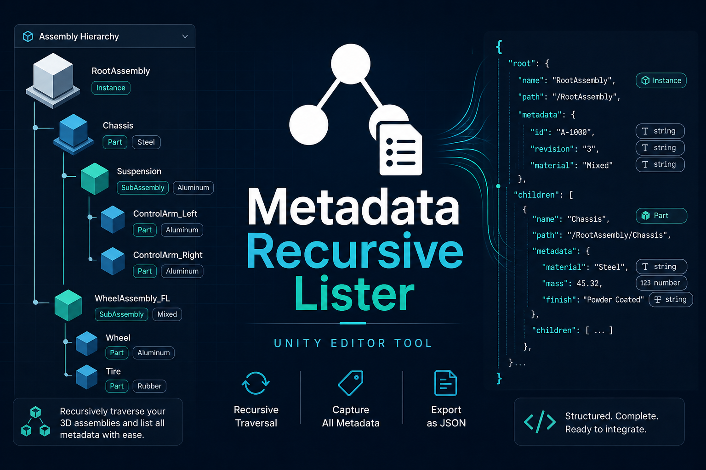
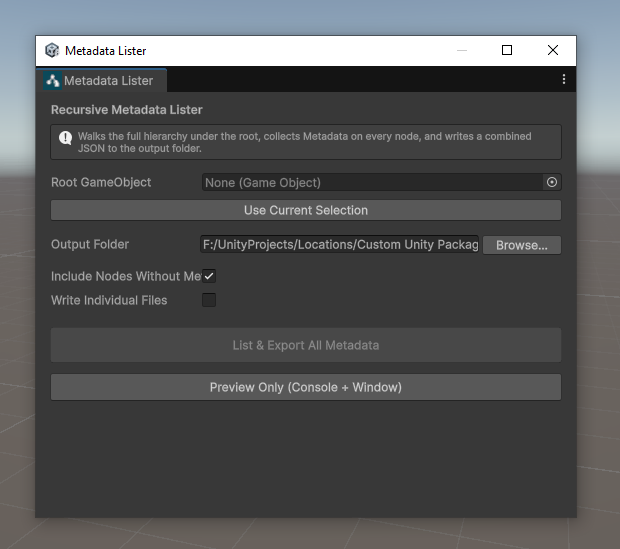

# Metadata Recursive Lister

<p align="center">
  
</p>

Unity Editor tool that walks a GameObject hierarchy, collects `Metadata` component properties on every node, and exports them to JSON.

**Package:** `com.polymaxcube.metadatarecursivelister`  
**Version:** 1.0.2  
**Unity:** 2022.3+  
**Author:** samiti  
**License:** [MIT](LICENSE)

[](LICENSE)

## Why use this?

CAD and engineering assemblies in Unity often carry rich `Metadata` on dozens or hundreds of hierarchy nodes. Inspecting that data by hand in the Inspector does not scale, and custom export scripts are easy to get out of sync.

This tool gives you a fast, Editor-native way to:

- **Audit large hierarchies** — see every node under a root, with depth and path, in one pass
- **Export Metadata as JSON** — pull `getProperties()` data into a format you can version, share, or feed into pipelines
- **Validate before you ship** — preview node counts and missing Metadata in the window/Console before writing files
- **Fit CAD / PLM workflows** — combined or per-part JSON suits documentation, BOM checks, and downstream tools
- **Stay in Unity** — no external app; open from **Tools**, pick a root, choose a folder, export

Use it when you need a reliable snapshot of hierarchy + Metadata instead of clicking through parts one by one.

## Features

- Recursively lists all nodes under a selected root GameObject
- Reads properties from components named `Metadata` via `getProperties()`
- Exports a combined JSON file for the whole hierarchy
- Optional per-node JSON files
- Preview hierarchy and metadata counts in the window and Console before exporting
- Configurable output folder (defaults to `Assets/CAD_Output/Metadata`)

## Install

### Git URL (UPM)

1. Open **Window → Package Manager**
2. Click **+ → Add package from git URL…**
3. Paste your repository URL, for example:

```
https://github.com/<user>/<repo>.git
```

To pin a version/tag:

```
https://github.com/<user>/<repo>.git#v1.0.1
```

### Local / embedded

Copy this folder into your project’s `Packages/` directory (or add it as a local package in the Package Manager).

## Usage

<p align="center">
  
</p>

1. Open **Tools → Metadata Recursive Lister**
2. Assign a **Root GameObject** (or click **Use Current Selection**)
3. Choose an **Output Folder**
4. Optionally toggle:
   - **Include Nodes Without Metadata** — export every hierarchy node, or only nodes that have a `Metadata` component
   - **Write Individual Files** — also write one JSON file per node
5. Click **Preview Only** to inspect the hierarchy, or **List & Export All Metadata** to write files

## Output

### Combined file

`<RootName>_all_nodes_metadata.json`

Example shape:

```json
{
  "rootName": "MyAssembly",
  "nodeCount": 42,
  "exportedAt": "2026-08-11T12:00:00.0000000+07:00",
  "nodes": [
    {
      "cadPartName": "Part_A",
      "hierarchyPath": "MyAssembly/Part_A",
      "instanceId": 12345,
      "depth": 1,
      "hasMetadata": true,
      "activeSelf": true,
      "activeInHierarchy": true,
      "childCount": 2,
      "properties": {
        "Material": "Steel",
        "PartNumber": "PN-001"
      }
    }
  ]
}
```

### Individual files (optional)

`<CadPartName>_metadata.json` — one file per exported node. Duplicate names get a numeric suffix.

## Requirements

- Unity **2022.3** or newer
- Scene hierarchy nodes may optionally carry a component named **`Metadata`** with a `getProperties()` method that returns `Dictionary<string, string>`

Nodes without `Metadata` can still be listed when **Include Nodes Without Metadata** is enabled; their `properties` object will be empty.

## Support

If this tool helps your workflow, you can support development here:

<p align="center">
  <a href="https://www.buymeacoffee.com/samiti3d" target="_blank" rel="noopener noreferrer">
    
  </a>
</p>

## License

Distributed under the **MIT License**. See [`LICENSE`](LICENSE) for the full text.

You are free to use, copy, modify, merge, publish, distribute, sublicense, and/or sell copies of this software, provided the copyright notice and permission notice are included in all copies or substantial portions of the Software.
